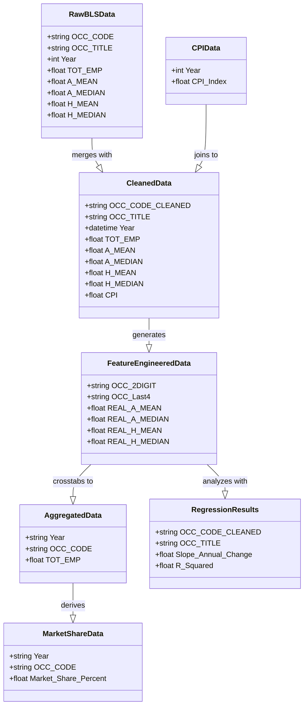

# analytics-applications-sp2026
Marlon, Monica, Blake, Charlotte
## Action Log (notes for teammates)
#### March 25 5:45pm [Charlotte 
- python notebook added
- retrospective charts in there for ppt
- next steps: need to understand scale is moving from 2% of US jobs to 4% a big move or not compared to other sectors?
  
#### March 24 6:52pm [Charlotte]
- Added the excel of all of the combo data plus the OCC_CODE_CLEANED
- We may need to check out the 1998/1997 codes and remap them (later) since it looks like they changed

### Bureau Labour Statistics
How have major tech events changes US employment since 1997?

---

## Data Transformation Pipeline

The `national_employment_charlotte.ipynb` notebook implements a multi-stage data transformation pipeline to analyze employment trends:

### Transformation Stages:

1. **Data Cleaning**: Removes null columns and single-value columns from raw BLS employment data
2. **CPI Integration**: Merges Consumer Price Index data for inflation adjustments
3. **Feature Engineering**: Creates hierarchical occupation codes and calculates inflation-adjusted salaries
4. **Aggregation**: Produces time-series data organized by occupation code and year
5. **Market Analysis**: Calculates market share percentages and relative changes from 1999 baseline
6. **Statistical Analysis**: Performs linear regression to identify trends in employment market share

---

## Data Structures (Class Diagram)

Represents the schema and relationships of key data tables at each stage:

